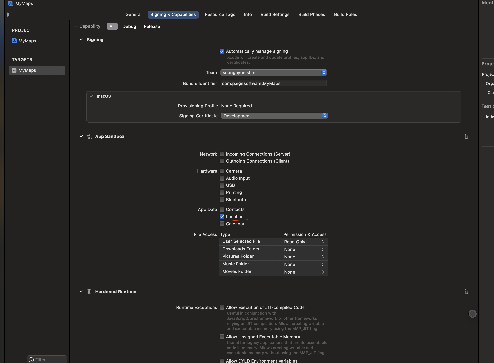

### Set Up Two Columns Layout 

```swift
struct HomeScreen: View {
    var body: some View {
        NavigationView {
            SideBar()
                .frame(minWidth: 300)
            MapScreen()
        } //: NavigationView
    } //: body
}

```

### Capability 

- To get user's current location




### Set Up Map View

```swift

import Foundation
import MapKit
import SwiftUI

struct MapView: NSViewRepresentable {
    
    typealias NSViewType = MKMapView
    
    func makeNSView(context: Context) -> MKMapView {
        let map = MKMapView()
        map.showsUserLocation = true
        map.delegate = context.coordinator
        return map
    }
    
    func updateNSView(_ nsView: MKMapView, context: Context) {
        
    }
    
    func makeCoordinator() -> MapViewCoordinator {
        MapViewCoordinator()
    }
    
}

final class MapViewCoordinator: NSObject, MKMapViewDelegate {
    
    func mapView(_ mapView: MKMapView, didUpdate userLocation: MKUserLocation) {
        let region = MKCoordinateRegion(
            center: mapView.userLocation.coordinate,
            span: MKCoordinateSpan(
                latitudeDelta: 0.2,
                longitudeDelta: 0.2
            )
        )
        mapView.setRegion(region, animated: true)
    }
    
}


```

### Zoom in to current user's location

```swift

    func mapView(_ mapView: MKMapView, didUpdate userLocation: MKUserLocation) {
        let region = MKCoordinateRegion(
            center: mapView.userLocation.coordinate,
            span: MKCoordinateSpan(
                latitudeDelta: 0.2,
                longitudeDelta: 0.2
            )
        )
        mapView.setRegion(region, animated: true)
    }

```

### Set Up Location Manager 

- this class contains updated `CLLocation`
- this class contains updated `MKCoordinateRegion`

```swift

import Foundation
import CoreLocation
import MapKit

final class LocationManager: NSObject, ObservableObject {
    
    private let locationManager = CLLocationManager()
    
    @Published var location: CLLocation?
    @Published var region: MKCoordinateRegion = MKCoordinateRegion()
    
    override init() {
        super.init()
        self.locationManager.desiredAccuracy = kCLLocationAccuracyBest
        self.locationManager.distanceFilter = kCLDistanceFilterNone
        self.locationManager.startUpdatingLocation()
        self.locationManager.delegate = self
    }
    
}

extension LocationManager: CLLocationManagerDelegate {
    
    func locationManager(_ manager: CLLocationManager, didUpdateLocations locations: [CLLocation]) {
        guard let location = locations.first else { return }
        DispatchQueue.main.async { [weak self] in
            self?.location = location
            self?.region = MKCoordinateRegion(
                center: location.coordinate,
                latitudinalMeters: 500, // Region's size
                longitudinalMeters: 500  // Region's size
            )
        }
    }
    
}


```

### MacOS Set Up SearchBar


- `searchable` Modifier with `List` 
- Without List, SearchBar doesn't show up

```swift

struct SideBar: View {
    
    @State private var search = ""
    
    var body: some View {
        VStack {
            List(1...20, id: \.self) { index in
                Text("Search Result: \(index)")
            } //: List
        } //: VStack
        .searchable(
            text: self.$search,
            placement: .sidebar,
            prompt: "Search Maps"
        )
    } //: body
}

```

### Search Places with Apple API

```swift
    let searchRequest = MKLocalSearch.Request()
    searchRequest.naturalLanguageQuery = text
    searchRequest.region = self.locationManager.region
    
    let search = MKLocalSearch(request: searchRequest)
    search.start { response, error in
        if let error { print(error) }
        guard let response = response, error == nil else {
            return 
        }
        print(response.mapItems)
    }
```

```swift
import Foundation
import MapKit

final class SearchResultsViewModel: ObservableObject {
    
    private var locationManager = LocationManager()
    
    func search(text: String, completion: @escaping() -> Void) {
        if text.count < 4 {
            return
        }
        let searchRequest = MKLocalSearch.Request()
        searchRequest.naturalLanguageQuery = text
        searchRequest.region = self.locationManager.region
        
        let search = MKLocalSearch(request: searchRequest)
        search.start { response, error in
            if let error { print(error) }
            guard let response = response, error == nil else {
                return 
            }
            print(response.mapItems)
        }
    }
    
}

final class LocationManager: NSObject, ObservableObject {
    
    private let locationManager = CLLocationManager()
    
    @Published var location: CLLocation?
    @Published var region: MKCoordinateRegion = MKCoordinateRegion()
    
    override init() {
        super.init()
        self.locationManager.desiredAccuracy = kCLLocationAccuracyBest
        self.locationManager.distanceFilter = kCLDistanceFilterNone
        self.locationManager.startUpdatingLocation()
        self.locationManager.delegate = self
    }
    
}

extension LocationManager: CLLocationManagerDelegate {
    
    func locationManager(_ manager: CLLocationManager, didUpdateLocations locations: [CLLocation]) {
        guard let location = locations.first else { return }
        DispatchQueue.main.async { [weak self] in
            self?.location = location
            self?.region = MKCoordinateRegion(
                center: location.coordinate,
                latitudinalMeters: 500, // Region's size
                longitudinalMeters: 500  // Region's size
            )
        }
    }
    
}


```

### Create Annotation

- This `PlaceAnnoatation` class is created to indicate places on the map and on the search result.

```swift
// Holds the data we want to display
final class PlaceAnnotation: NSObject, MKAnnotation, Identifiable {
    let id = UUID()
    private var mapItem: MKMapItem
    
    init(mapItem: MKMapItem) {
        self.mapItem = mapItem
    }
    
    var title: String? { self.mapItem.name ?? "" }
    var phone: String { self.mapItem.phoneNumber ?? "" }
    var address: String {
        guard let postalAddress = mapItem.placemark.postalAddress else { return "" }
        return "\(postalAddress.street), \(postalAddress.city) \(postalAddress.state), \(postalAddress.postalCode)"
    }
    var location: CLLocation? { CLLocation(latitude: self.coordinate.latitude, longitude: self.coordinate.longitude) }
    var coordinate: CLLocationCoordinate2D { self.mapItem.placemark.coordinate }
    var city: String { self.mapItem.placemark.locality ?? "" }
}


```

- Take MapItems and return PlaceAnnotation

```swift
import Foundation
import MapKit

final class SearchResultsViewModel: ObservableObject {
    
    private var locationManager = LocationManager()
    
    func search(text: String, completion: @escaping([PlaceAnnotation]) -> Void) {
        guard text.count >= 2 else {
            completion([])
            return
        }
       
        let searchRequest = MKLocalSearch.Request()
        searchRequest.naturalLanguageQuery = text
        searchRequest.region = self.locationManager.region
        
        let search = MKLocalSearch(request: searchRequest)
        search.start { response, error in
            if let error { print(error) }
            guard let response = response, error == nil else {
                completion([])
                return
            }
            let places = response.mapItems.map(PlaceAnnotation.init)
            completion(places)
        }
    }
    
}


```

### Get Distance

```swift
    func getDistance(userLocation: CLLocation?) -> Double? {
        guard let placeLocation = self.mapItem.placemark.location,
              let userLocation = userLocation else {
            return nil
        }
        return userLocation.distance(from: placeLocation)
    }
```

```swift
import Foundation
import MapKit
import Contacts

// Holds the data we want to display
final class PlaceAnnotation: NSObject, MKAnnotation, Identifiable {
    let id = UUID()
    private var mapItem: MKMapItem
    
    init(mapItem: MKMapItem) {
        self.mapItem = mapItem
    }
    
    var title: String? { self.mapItem.name ?? "" }
    var phone: String { self.mapItem.phoneNumber ?? "" }
    var address: String {
        guard let postalAddress = mapItem.placemark.postalAddress else { return "" }
        return "\(postalAddress.street), \(postalAddress.city) \(postalAddress.state), \(postalAddress.postalCode)"
    }
    var location: CLLocation? { CLLocation(latitude: self.coordinate.latitude, longitude: self.coordinate.longitude) }
    var coordinate: CLLocationCoordinate2D { self.mapItem.placemark.coordinate }
    var city: String { self.mapItem.placemark.locality ?? "" }
    
    func getDistance(userLocation: CLLocation?) -> Double? {
        guard let placeLocation = self.mapItem.placemark.location,
              let userLocation = userLocation else {
            return nil
        }
        return userLocation.distance(from: placeLocation)
    }
 
}


```

### Display Annoations on the map

```swift
import Foundation
import MapKit
import SwiftUI

struct MapView: NSViewRepresentable {
    
    typealias NSViewType = MKMapView
    
    private var annotations: [PlaceAnnotation] = []
    
    init(annotations: [PlaceAnnotation]) {
        self.annotations = annotations
    }
    
    func makeNSView(context: Context) -> MKMapView {
        let map = MKMapView()
        map.showsUserLocation = true
        map.delegate = context.coordinator
        return map
    }
    
    func updateNSView(_ map: MKMapView, context: Context) {
        // remove all annotations
        map.removeAnnotations(map.annotations)
        
        // add annotations
        map.addAnnotations(self.annotations)
    }
    
    func makeCoordinator() -> MapViewCoordinator {
        MapViewCoordinator()
    }
    
}

```

### Displaying a call-out view

```swift
import Foundation
import AppKit
import MapKit

final class MapViewCoordinator: NSObject, MKMapViewDelegate {
    
    func mapView(_ mapView: MKMapView, didUpdate userLocation: MKUserLocation) {
        print("User Location => \(userLocation)")
        let region = MKCoordinateRegion(
            center: mapView.userLocation.coordinate,
            span: MKCoordinateSpan(
                latitudeDelta: 0.2,
                longitudeDelta: 0.2
            )
        )
        mapView.setRegion(region, animated: true)
    }
    
    func mapView(_ mapView: MKMapView, didSelect view: MKAnnotationView) {
        guard let annotation = view.annotation as? PlaceAnnotation else { return }
        view.canShowCallout = true
        view.detailCalloutAccessoryView = PlaceCallOutView(annotation: annotation)
    }
    
}

final class PlaceCallOutView: NSView {
    
    private var annotation: PlaceAnnotation
    
    private lazy var directionButton: NSButton = {
        let button = NSButton(frame: NSRect(x: 0, y: 0, width: 100, height: 100))
        button.title = "Get Directions"
        button.wantsLayer = true
        button.isBordered = false
        return button
    }()
    
    private lazy var phoneTextField: NSTextField = {
        let textField = NSTextField(frame: CGRect(x: 0, y: 0, width: 100, height: 60))
        textField.stringValue = "Phone \n \(self.annotation.phone)"
        textField.isEditable = false
        textField.isBezeled = false
        return textField
    }()
    
    private lazy var addressTextField: NSTextField = {
        let textField = NSTextField(frame: CGRect(x: 0, y: 0, width: 100, height: 60))
        textField.stringValue = self.annotation.address
        textField.isEditable = false
        textField.isBezeled = false
        return textField
    }()
    
    init(
        annotation: PlaceAnnotation,
        frame: CGRect = CGRect(x: 0, y: 0, width: 400, height: 400)
    ) {
        self.annotation = annotation
        super.init(frame: frame)
        self.configure()
    }
    
    required init?(coder: NSCoder) {
        fatalError("Not Implemented...")
    }
    
    private func configure() {
        
        let stackView = NSStackView(frame: self.frame)
        stackView.alignment = .left
        stackView.orientation = .vertical
        stackView.edgeInsets = .init(top: 0, left: 20, bottom: 0, right: 20)
        
        stackView.addArrangedSubview(self.directionButton)
        stackView.addArrangedSubview(self.phoneTextField)
        stackView.addArrangedSubview(self.addressTextField)
        
        let scrollView = NSScrollView(frame: self.frame)
        scrollView.hasVerticalScroller = true
        scrollView.documentView = stackView
        
        self.addSubview(scrollView)
        
    }
    
}

```

### Get the snapshot of the place image

```swift
        /// Snapshot  for  image of the place
        let options = MKMapSnapshotter.Options()
        options.size = CGSize(width: self.frame.width, height: self.frame.height / 2)
        options.mapType = .standard
        options.camera = MKMapCamera(
            lookingAtCenter: self.annotation.coordinate,
            fromDistance: 250,
            pitch: 65,
            heading: 0
        )
        let snapshotter = MKMapSnapshotter(options: options)
        snapshotter.start { snapshot, error in
            if let error { print(error) }
            guard let snapshot = snapshot, error == nil else { return }
            DispatchQueue.main.async {
                let imageView = NSImageView(frame: NSRect(x: 0, y: 0, width: 100, height: 100))
                imageView.image = snapshot.image
                // Insert Image Later
                stackView.insertView(imageView, at: 0, in: .top)
            }
        }
```

```swift
import Foundation
import AppKit
import MapKit

final class MapViewCoordinator: NSObject, MKMapViewDelegate {
    
    func mapView(_ mapView: MKMapView, didUpdate userLocation: MKUserLocation) {
        print("User Location => \(userLocation)")
        let region = MKCoordinateRegion(
            center: mapView.userLocation.coordinate,
            span: MKCoordinateSpan(
                latitudeDelta: 0.2,
                longitudeDelta: 0.2
            )
        )
        mapView.setRegion(region, animated: true)
    }
    
    func mapView(_ mapView: MKMapView, didSelect view: MKAnnotationView) {
        guard let annotation = view.annotation as? PlaceAnnotation else { return }
        view.canShowCallout = true
        view.detailCalloutAccessoryView = PlaceCallOutView(annotation: annotation)
    }
    
}

final class PlaceCallOutView: NSView {
    
    private var annotation: PlaceAnnotation
    
    private lazy var directionButton: NSButton = {
        let button = NSButton(frame: NSRect(x: 0, y: 0, width: 100, height: 100))
        button.title = "Get Directions"
        button.wantsLayer = true
        button.isBordered = false
        return button
    }()
    
    private lazy var phoneTextField: NSTextField = {
        let textField = NSTextField(frame: CGRect(x: 0, y: 0, width: 100, height: 60))
        textField.stringValue = "Phone \n \(self.annotation.phone)"
        textField.isEditable = false
        textField.isBezeled = false
        return textField
    }()
    
    private lazy var addressTextField: NSTextField = {
        let textField = NSTextField(frame: CGRect(x: 0, y: 0, width: 100, height: 60))
        textField.stringValue = self.annotation.address
        textField.isEditable = false
        textField.isBezeled = false
        return textField
    }()
    
    init(
        annotation: PlaceAnnotation,
        frame: CGRect = CGRect(x: 0, y: 0, width: 400, height: 400)
    ) {
        self.annotation = annotation
        super.init(frame: frame)
        self.configure()
    }
    
    required init?(coder: NSCoder) {
        fatalError("Not Implemented...")
    }
    
    private func configure() {
        
        let stackView = NSStackView(frame: self.frame)
        stackView.alignment = .left
        stackView.orientation = .vertical
        stackView.edgeInsets = .init(top: 0, left: 20, bottom: 0, right: 20)
        
        /// Snapshot  for  image of the place
        let options = MKMapSnapshotter.Options()
        options.size = CGSize(width: self.frame.width, height: self.frame.height / 2)
        options.mapType = .standard
        options.camera = MKMapCamera(
            lookingAtCenter: self.annotation.coordinate,
            fromDistance: 250,
            pitch: 65,
            heading: 0
        )
        let snapshotter = MKMapSnapshotter(options: options)
        snapshotter.start { snapshot, error in
            if let error { print(error) }
            guard let snapshot = snapshot, error == nil else { return }
            DispatchQueue.main.async {
                let imageView = NSImageView(frame: NSRect(x: 0, y: 0, width: 100, height: 100))
                imageView.image = snapshot.image
                // Insert Image Later
                stackView.insertView(imageView, at: 0, in: .top)
            }
        }
        
        stackView.addArrangedSubview(self.directionButton)
        stackView.addArrangedSubview(self.phoneTextField)
        stackView.addArrangedSubview(self.addressTextField)
        
        let scrollView = NSScrollView(frame: self.frame)
        scrollView.hasVerticalScroller = true
        scrollView.documentView = stackView
        
        self.addSubview(scrollView)
        
    }
    
}

```

### Select Place

```swift
        if let selectedPlace = self.selectedPlace {
            map.selectAnnotation(selectedPlace, animated: true)
        }
```

```swift
import Foundation
import MapKit
import SwiftUI

struct MapView: NSViewRepresentable {
    
    typealias NSViewType = MKMapView
    
    private var annotations: [PlaceAnnotation] = []
    private var selectedPlace: PlaceAnnotation?
    
    init(
        annotations: [PlaceAnnotation],
        selectedPlace: PlaceAnnotation?
    ) {
        self.annotations = annotations
        self.selectedPlace = selectedPlace
    }
    
    func makeNSView(context: Context) -> MKMapView {
        let map = MKMapView()
        map.showsUserLocation = true
        map.delegate = context.coordinator
        return map
    }
    
    func updateNSView(_ map: MKMapView, context: Context) {
        // remove all annotations
        map.removeAnnotations(map.annotations)
        
        // add annotations
        map.addAnnotations(self.annotations)
        
        if let selectedPlace = self.selectedPlace {
            map.selectAnnotation(selectedPlace, animated: true)
        }
    }
    
    func makeCoordinator() -> MapViewCoordinator {
        MapViewCoordinator()
    }
    
}

```

### Get Direction

```swift
    func mapView(_ mapView: MKMapView, didSelect view: MKAnnotationView) {
        guard let annotation = view.annotation as? PlaceAnnotation else { return }
        view.canShowCallout = true
        view.detailCalloutAccessoryView = PlaceCallOutView(
            annotation: annotation,
            selectShowDirections: { [weak self] place in
                // Calculate Direction
                let start = MKMapItem.forCurrentLocation()
                let destination = MKMapItem(placemark: MKPlacemark(coordinate: place.coordinate))
                self?.calculateRoute(start: start, destination: destination)
            }
        )
    }
    
    private func calculateRoute(start: MKMapItem, destination: MKMapItem) {
        let directionRequest = MKDirections.Request()
        directionRequest.transportType = .automobile // car
        directionRequest.source = start
        directionRequest.destination = destination
        let direction = MKDirections(request: directionRequest)
        direction.calculate { response, error in
            if let error { print(error) }
            guard
                let response = response,
                let route = response.routes.first,
                error == nil else {
                return
            }
            for step in route.steps {
                print(step.instructions)
                // Something like this will be printed out 
                // Turn right onth Linden Chase Ln
                // Turn left onth Kingford Ln ....
            }
        }
    }
```

(Entire Code) 

```swift
import Foundation
import AppKit
import MapKit

final class PlaceCallOutView: NSView {
    
    private var annotation: PlaceAnnotation
    
    private var selectShowDirections: (PlaceAnnotation) -> Void
    
    private lazy var directionButton: NSButton = {
        let button = NSButton(frame: NSRect(x: 0, y: 0, width: 100, height: 100))
        button.title = "Get Directions"
        button.wantsLayer = true
        button.isBordered = false
        button.target = self
        button.action = #selector(self.handleShowDirection)
        return button
    }()
    
    @objc
    private func handleShowDirection() {
        self.selectShowDirections(self.annotation)
    }
    
    private lazy var phoneTextField: NSTextField = {
        let textField = NSTextField(frame: CGRect(x: 0, y: 0, width: 100, height: 60))
        textField.stringValue = "Phone \n \(self.annotation.phone)"
        textField.isEditable = false
        textField.isBezeled = false
        return textField
    }()
    
    private lazy var addressTextField: NSTextField = {
        let textField = NSTextField(frame: CGRect(x: 0, y: 0, width: 100, height: 60))
        textField.stringValue = self.annotation.address
        textField.isEditable = false
        textField.isBezeled = false
        return textField
    }()
    
    init(
        annotation: PlaceAnnotation,
        selectShowDirections: @escaping(PlaceAnnotation) -> Void,
        frame: CGRect = CGRect(x: 0, y: 0, width: 400, height: 400)
    ) {
        self.annotation = annotation
        self.selectShowDirections = selectShowDirections
        super.init(frame: frame)
        self.configure()
    }
    
    required init?(coder: NSCoder) {
        fatalError("Not Implemented...")
    }
    
    private func configure() {
        
        let stackView = NSStackView(frame: self.frame)
        stackView.alignment = .left
        stackView.orientation = .vertical
        stackView.edgeInsets = .init(top: 0, left: 20, bottom: 0, right: 20)
        
        /// Snapshot  for  image of the place
        let options = MKMapSnapshotter.Options()
        options.size = CGSize(width: self.frame.width, height: self.frame.height / 2)
        options.mapType = .standard
        options.camera = MKMapCamera(
            lookingAtCenter: self.annotation.coordinate,
            fromDistance: 250,
            pitch: 65,
            heading: 0
        )
        let snapshotter = MKMapSnapshotter(options: options)
        snapshotter.start { snapshot, error in
            if let error { print(error) }
            guard let snapshot = snapshot, error == nil else { return }
            DispatchQueue.main.async {
                let imageView = NSImageView(frame: NSRect(x: 0, y: 0, width: 100, height: 100))
                imageView.image = snapshot.image
                // Insert Image Later
                stackView.insertView(imageView, at: 0, in: .top)
            }
        }
        
        stackView.addArrangedSubview(self.directionButton)
        stackView.addArrangedSubview(self.phoneTextField)
        stackView.addArrangedSubview(self.addressTextField)
        
        let scrollView = NSScrollView(frame: self.frame)
        scrollView.hasVerticalScroller = true
        scrollView.documentView = stackView
        
        self.addSubview(scrollView)
        
    }
    
}

```

```swift 
import Foundation
import AppKit
import MapKit

final class MapViewCoordinator: NSObject, MKMapViewDelegate {
    
    func mapView(_ mapView: MKMapView, didUpdate userLocation: MKUserLocation) {
        let region = MKCoordinateRegion(
            center: mapView.userLocation.coordinate,
            span: MKCoordinateSpan(
                latitudeDelta: 0.2,
                longitudeDelta: 0.2
            )
        )
        mapView.setRegion(region, animated: true)
    }
    
    func mapView(_ mapView: MKMapView, didSelect view: MKAnnotationView) {
        guard let annotation = view.annotation as? PlaceAnnotation else { return }
        view.canShowCallout = true
        view.detailCalloutAccessoryView = PlaceCallOutView(
            annotation: annotation,
            selectShowDirections: { [weak self] place in
                // Calculate Direction
                let start = MKMapItem.forCurrentLocation()
                let destination = MKMapItem(placemark: MKPlacemark(coordinate: place.coordinate))
                self?.calculateRoute(start: start, destination: destination)
            }
        )
    }
    
    private func calculateRoute(start: MKMapItem, destination: MKMapItem) {
        let directionRequest = MKDirections.Request()
        directionRequest.transportType = .automobile // car
        directionRequest.source = start
        directionRequest.destination = destination
        let direction = MKDirections(request: directionRequest)
        direction.calculate { response, error in
            if let error { print(error) }
            guard
                let response = response,
                let route = response.routes.first,
                error == nil else {
                return
            }
            for step in route.steps {
                print(step.instructions)
                // Something like this will be printed out 
                // Turn right onth Linden Chase Ln
                // Turn left onth Kingford Ln ....
            }
        }
    }
    
}


```

### MacOS PopOver CallOutView using AppKit 


```swift
    let controller = RouteContentViewController(route: route)
    let routePopOver = RoutePopOver(controller: controller)
    let rect = NSRect(x: mapView.frame.width / 2.6, y: 0, width: mapView.frame.width / 2, height: 30.0)
    let positioningView = NSView(frame: rect)
    mapView.addSubview(positioningView)
    routePopOver.show(relativeTo: positioningView.frame, of: positioningView, preferredEdge: .minY)
```


```swift
import Foundation
import AppKit
import MapKit

final class RoutePopOver: NSPopover {
    
    init(controller: RouteContentViewController) {
        super.init()
        self.contentViewController = controller
        self.contentSize = controller.view.frame.size
        self.behavior = .transient
    }
    
    required init?(coder: NSCoder) {
        super.init(coder: coder)
    }
    
}

```

```swift
import Foundation
import AppKit
import MapKit

final class RouteContentViewController: NSViewController {
    
    private var route: MKRoute
    
    init(route: MKRoute) {
        self.route = route
        super.init(nibName: nil, bundle: nil)
    }
    
    override func loadView() {
        self.view = RouteCallOutView(route: self.route)
    }
    
    required init?(coder: NSCoder) {
        fatalError("Not Implemented...")
    }
    
}

```

```swift
import Foundation
import MapKit
import AppKit

final class RouteCallOutView: NSView {
    
    private var route: MKRoute
    
    init(
        route: MKRoute,
        frame: NSRect = NSRect(x: 0, y: 0, width: 300, height: 400)
    ) {
        self.route = route
        super.init(frame: frame)
        self.configure()
    }
    
    required init?(coder: NSCoder) {
        fatalError("Not Implemented...")
    }
    
    private func configure() {
        let documentView = NSView(frame: .zero)
        var offsetY: CGFloat = 0
        for step in self.route.steps {
            
            if step.instructions.isEmpty {
                continue
            }
            
            let hStackView = NSStackView(frame: CGRect(x: 0, y: offsetY, width: self.frame.width, height: 69))
            hStackView.edgeInsets = .init(top: 20, left: 20, bottom: 0, right: 20)
            hStackView.alignment = .left
            hStackView.orientation = .horizontal
            
            let instructionsTextField = NSTextField(frame: CGRect(x: 0, y: 0, width: 100, height: 60))
            instructionsTextField.stringValue = step.instructions
            instructionsTextField.isEditable = false
            instructionsTextField.isBezeled = false
            
            let vStackView = NSStackView()
            vStackView.alignment = .leading
            vStackView.orientation = .vertical
            
            vStackView.addArrangedSubview(instructionsTextField)
            hStackView.addArrangedSubview(vStackView)
        
            documentView.addSubview(hStackView)
            
            offsetY += 60
        }
        
        documentView.frame = .init(x: 0, y: 0, width: 400, height: offsetY)
        
        let scrollView = NSScrollView(frame: self.frame)
        scrollView.hasVerticalScroller = true
        scrollView.documentView = documentView
        scrollView.automaticallyAdjustsContentInsets = false
        scrollView.contentInsets = NSEdgeInsets(top: 10, left: 0, bottom: 10, right: 0)
        
        scrollView.documentView?.scroll(NSPoint(x: 0, y: documentView.frame.height))
        scrollView.verticalScroller?.floatValue = 0
        
        self.addSubview(scrollView)
        
    }
    
}

```

### Add Overlay

- This draw line from your position to destination 

```swift
// clear all the overlays
mapView.removeOverlays(mapView.overlays)

// add overlay on the mapp
mapView.addOverlay(route.polyline, level: .aboveRoads)
```

```swift
func mapView(_ mapView: MKMapView, rendererFor overlay: MKOverlay) -> MKOverlayRenderer {
    let renderer = MKPolylineRenderer(overlay: overlay)
    renderer.lineWidth = 5.0
    renderer.strokeColor = NSColor.purple
    return renderer
}
```

```swift
//
//  MapViewCoordinator.swift
//  MyMaps
//
//  Created by paige shin on 10/20/23.
//

import Foundation
import AppKit
import MapKit

final class MapViewCoordinator: NSObject, MKMapViewDelegate {
    
    func mapView(_ mapView: MKMapView, didUpdate userLocation: MKUserLocation) {
        let region = MKCoordinateRegion(
            center: mapView.userLocation.coordinate,
            span: MKCoordinateSpan(
                latitudeDelta: 0.2,
                longitudeDelta: 0.2
            )
        )
        mapView.setRegion(region, animated: true)
    }
    
    func mapView(_ mapView: MKMapView, didSelect view: MKAnnotationView) {
        guard let annotation = view.annotation as? PlaceAnnotation else { return }
        view.canShowCallout = true
        view.detailCalloutAccessoryView = PlaceCallOutView(
            annotation: annotation,
            selectShowDirections: { [weak self] place in
                // Calculate Direction
                let start = MKMapItem.forCurrentLocation()
                let destination = MKMapItem(placemark: MKPlacemark(coordinate: place.coordinate))
                self?.calculateRoute(
                    start: start,
                    destination: destination,
                    completion: { route in
                        guard let route = route else { return }
                        view.detailCalloutAccessoryView = nil // replacing with route view
                        let controller = RouteContentViewController(route: route)
                        let routePopOver = RoutePopOver(controller: controller)
                        let rect = NSRect(x: mapView.frame.width / 2.6, y: 0, width: mapView.frame.width / 2, height: 30.0)
                        let positioningView = NSView(frame: rect)
                        mapView.addSubview(positioningView)
                        
                        // clear all the overlays
                        mapView.removeOverlays(mapView.overlays)
                        
                        // add overlay on the mapp
                        mapView.addOverlay(route.polyline, level: .aboveRoads)
                        
                        routePopOver.show(relativeTo: positioningView.frame, of: positioningView, preferredEdge: .minY)
                    }
                )
            }
        )
    }
    
    func mapView(_ mapView: MKMapView, rendererFor overlay: MKOverlay) -> MKOverlayRenderer {
        let renderer = MKPolylineRenderer(overlay: overlay)
        renderer.lineWidth = 5.0
        renderer.strokeColor = NSColor.purple
        return renderer
    }
    
    private func calculateRoute(
        start: MKMapItem,
        destination: MKMapItem,
        completion: @escaping(MKRoute?) -> Void
    ) {
        let directionRequest = MKDirections.Request()
        directionRequest.transportType = .automobile // car
        directionRequest.source = start
        directionRequest.destination = destination
        let direction = MKDirections(request: directionRequest)
        direction.calculate { response, error in
            if let error { print(error) }
            guard
                let response = response,
                let route = response.routes.first,
                error == nil else {
                return
            }
            completion(route)
        }
    }
    
}


```
